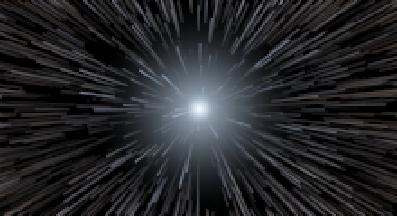
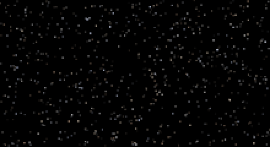
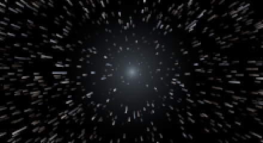
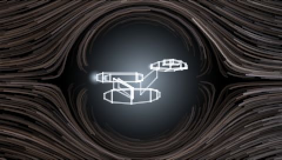

# warp-rs

Fly a starship through the universe at warp, in your terminal.



Stars live in a real 3D volume ahead of the ship and stream past the canopy.
Each one is drawn as the segment between where it was last frame and where it
is now, accumulated into a floating-point buffer and tonemapped at the end — so
overlapping streaks bloom instead of clipping, and the classic hyperspace smear
falls out of the motion rather than being drawn as a special effect.

## Running it

```sh
cargo run --release
```

Or, without a keyboard, on autopilot:

```sh
cargo run --release -- --demo
```

## Flying

| Key | |
| --- | --- |
| `W` `S` / `I` `K` | Pitch — nose up and nose down. Cockpit only |
| `A` `D` / `←` `→` | Yaw — nose left and nose right. Cockpit only |
| `Q` `E` | Roll — port and starboard |
| `↑` `↓` | Throttle |
| `Space` | Engage or disengage the warp drive |
| `C` | Cycle the camera — cockpit, then outside |
| `M` | Pick a ship |
| `+` `-` | More or fewer stars |
| `P` | Pause |
| `R` | Reset |
| `Esc` / `Ctrl-C` / `Ctrl-D` | Quit |

Throttle and steering are impulse-driven — a press nudges the ship and it eases
back on its own — because terminals report key presses but not releases. Hold a
key and auto-repeat does the rest.

The three axes are the ship's, not the screen's, so they compose the way an
aircraft's do: roll ninety degrees and pitch has come round to where yaw was, so
`Q` and then `W` is a turn. Pitch stops short of straight up, because there is
no way back over the top — roll has no such stop, so `Q` or `E` held down is a
barrel roll.

A roll you are not currently flying is invisible against a starfield, since
space has no horizon to be level with, so the panel carries a `ROLL` readout.
It is the only thing that will tell you the ship is inverted once the sky has
stopped turning.

`Q` steers rather than quits, so a hand on the stick cannot end the flight by
accident. `Esc` or `Ctrl-C` gets you out.

## What you are looking at

**Impulse** — sublight. Stars are points, faintly twinkling, and the instrument
panel reads a fraction of *c*.



**Spooling up** — past the light barrier the streaks lengthen, the field starts
to bend outward, and a glare opens up down the throat of the tunnel.



Engaging the drive kicks the view and whites out the frame; dropping out bleeds
speed off much harder than a normal throttle-down. The panel reports velocity in
multiples of *c*, warp factor on the TNG scale (`v = w^(10/3)·c`), distance
travelled, heading, and roll.

Stars are coloured by spectral class, weighted toward the hot end of the main
sequence — which is what actually fills a real sky, since apparent brightness
favours the bright ones. As speed climbs they Doppler-shift: blue toward the
vanishing point, red out at the edges where they are falling behind.

Flight time is compressed so the odometer moves: one second at the stick is one
day underway, which is about 5 light years per second at full warp.

## From outside the ship



`C` moves the camera off the ship's starboard beam. The hull is there in
profile, the sky streams astern past it, and the stars nearest the camera sweep
by while the far ones crawl — the same depth parallax the cockpit view has, seen
sideways on.

Light the drive out here and the sky bends. A warp bubble is a lump of curved
spacetime and it lenses starlight exactly as any other mass would: the sky
behind the ship is pushed outward, away from the bubble, so a disc around the
hull is swept clear, and the light that used to be there piles up into a bright
rim just outside it. Streaks passing close bend into arcs around that rim rather
than running straight past it, and a second, fainter image of each one appears
on the far side — the counter-image every gravitational lens produces, and the
thing that makes one read as a lens rather than as a smudge. Inside the bubble
nothing is drawn at all: a transparent mass would refill that disc with a
shrunken copy of the whole sky, and a warp bubble is no more transparent than a
hull is.

The camera rides with the ship rather than with the sky, so a roll turns the
*hull* against a level starfield — `Q` or `E` held down is a barrel roll you can
watch from the outside, which is the one thing the view from the cockpit cannot
show you.

The same fact switches the other two axes off. Pointing the nose is something
you do from behind it: out here a turn moves nothing an eye can see, since the
stars stream on exactly as they were and the hull leans a few degrees, so pitch
and yaw are simply not connected in this view and the hint line stops offering
them. Press `C` to go back inside and the stick comes back with it. Throttle,
warp and roll work in both.

`M` opens a picker for the six hulls. It takes the camera outside if it is not
already, and moving through the list flies each ship rather than naming it:

| Ship | |
| --- | --- |
| `enterprise` | Heavy cruiser. Saucer, neck, and two nacelles. The default. |
| `dart` | Interceptor. All nose and engine. |
| `hauler` | Bulk freighter. Slow, and does not care. |
| `needle` | Survey probe. Mostly sensor. |
| `beetle` | Gunship. Built round its own armour. |
| `trident` | Line warship. Three drives, one spine. |

The default is a bow to the ship every warp drive since has been drawn
against — saucer, neck, engineering hull, two nacelles on swept pylons. It is
built as a *profile*, because that is the only view this camera gives, and the
profile is three masses stacked in a particular order: saucer highest and
furthest forward, nacelles below and well aft, engineering hull slung underneath.
Get the stacking wrong and every line is still in the right place while the ship
stops being that ship.

Each hull is a closed solid of a few dozen plates, drawn opaque: the plates
cover the sky rather than adding to it, so a star never shines through a
starship. There is still no depth buffer and still no need of one. The star band
starts well beyond the hull, so nothing can come between it and the camera; the
far side of each plate is dropped on the sign of its projected area; and what is
left is painted far to near, which is what settles a nacelle passing in front of
an engineering hull. One lamp and a Lambert term do the shading — at a
resolution where a plate is a handful of subpixels, anything subtler is spent
where nobody can see it.

## As a tmux screensaver

`--screensaver` flies on autopilot indefinitely and quits on **any** key, which
is exactly the contract tmux's `lock-command` wants: tmux runs the command when
a client goes idle and unlocks when it exits.

Put the binary somewhere on `PATH`:

```sh
cargo install --path .
```

Then in `~/.tmux.conf`:

```tmux
set -g lock-after-time 300              # idle seconds before it kicks in
set -g lock-command "warp --screensaver"
```

Reload with `tmux source-file ~/.tmux.conf`. Leave a session alone for five
minutes and the stars come out; press anything and you are back where you were.

tmux binds no key to `lock-session` by default, so add one if you want to
trigger it on demand:

```tmux
bind L lock-session
```

Note that `lock-server` is on by default, which means all sessions lock together
on the server's idle time. `set -g lock-server off` makes it per-session.

This is a screensaver, not a lock: any key dismisses it and no password is
asked for. If you want the screen actually *locked*, chain a real locker —
`set -g lock-command "warp --screensaver; vlock"`.

### Without the lock mechanism

As a popup over whatever you are working on (tmux 3.2+), where `-E` closes it
when the command exits:

```tmux
bind W display-popup -E -w 90% -h 90% "warp --screensaver"
```

Or just as a window: `tmux new-window -n warp 'warp --screensaver'`.

## Options

| Flag | |
| --- | --- |
| `--demo [SECS]` | Fly on autopilot, then exit. Defaults to 45 seconds. |
| `--screensaver` | Fly on autopilot forever; any key quits. For tmux's `lock-command`. |
| `--stars N` | Star count. `0` (default) suits it to the terminal. |
| `--fps N` | Frame rate cap. Default 60. |
| `--color auto\|truecolor\|256\|ascii` | Colour depth. Auto-detected by default. |
| `--engage` | Start with the drive already lit. |
| `--view cockpit\|side` | Which camera to start behind. `C` cycles them. |
| `--ship NAME` | Which ship to fly. Only visible from outside. |
| `--throttle 0..1` | Starting throttle. |
| `--exposure N` | Tonemap exposure. Higher is brighter. |
| `--seed N` | Fix the sky. Omit for a different one each run. |
| `--size COLSxROWS` | Override the terminal size. |
| `--headless --frames N` | Print frames to stdout instead of taking over the terminal. |

## Terminals

The renderer targets 24-bit colour and draws with the upper half block, `▀`:
foreground paints the top pixel, background the bottom, so each cell is two
roughly square pixels and the field stays circular instead of being squashed
by cells that are twice as tall as they are wide.

Where truecolor is not available it degrades — to the xterm 256-colour palette,
and past that to a plain ASCII brightness ramp. `--color` forces the choice if
detection guesses wrong.

`--color ascii` is for a terminal that cannot be sent colour, so it is not sent
any: no escape codes beyond the cursor moves the grid is painted with, and an
instrument panel that swaps its box rules, block bars and degree signs for
characters a 1970s terminal would recognise. Piped rather than displayed, that
mode is plain text and nothing else.

Only cells that changed are re-emitted each frame, and colour codes are only
re-sent when they differ from the last cell written.

## Development

```sh
cargo test
cargo fmt --all --check
cargo clippy --all-targets --all-features -- -D warnings
```

CI runs these on Linux, macOS and Windows, checks that the crate still builds
on the `rust-version` in `Cargo.toml`, and re-checks the reproducibility
property below.

To see where a frame goes — simulating the flight, drawing it, and getting it
out — against the 16.7 ms that 60 fps allows:

```sh
cargo run --release --example bench
cargo run --release --example bench 200 60 20000    # a specific size and count
```

`--headless` renders with a fixed timestep and no terminal control, so with a
fixed `--seed` the same flight produces byte-identical output — useful for
checking that a change to the renderer changed only what you meant it to:

```sh
cargo run --release -- --headless --frames 120 --seed 1 --size 120x36 --demo | sha256sum
```

Repeatable is not the same as unchanged, though — a renderer that draws every
frame differently is still perfectly repeatable about it — so the bytes
themselves are committed, in `tests/golden/frames.sha256`, and CI checks
against them. An edit meant to touch one thing that touched the whole sky
fails there; when the change was the point, that file says how to regenerate
it. The hashes hold across build profiles and rustc versions but not across
platforms, so they are only checked on Linux.

The `snapshot` feature writes a frame out as a PNG, which is a great deal easier
to look at than a wall of escape codes:

```sh
cargo run --release --features snapshot -- \
    --snapshot warp.png --engage --throttle 1.0 --warmup 600 --scale 2
```

The images in this README were produced that way. Note that the snapshot is the
starfield only — the instrument panel lives in the character grid, not in the
pixel buffer.

`src/lib.rs` carries the whole thing — flight model, starfield, renderer,
terminal — and `src/main.rs` is only the entry point, so the pieces can be
driven from `tests/` or from another program.

## License

MIT. See [LICENSE](LICENSE).
